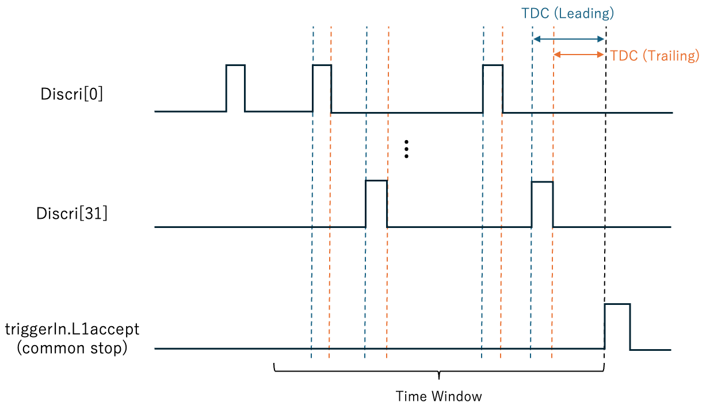
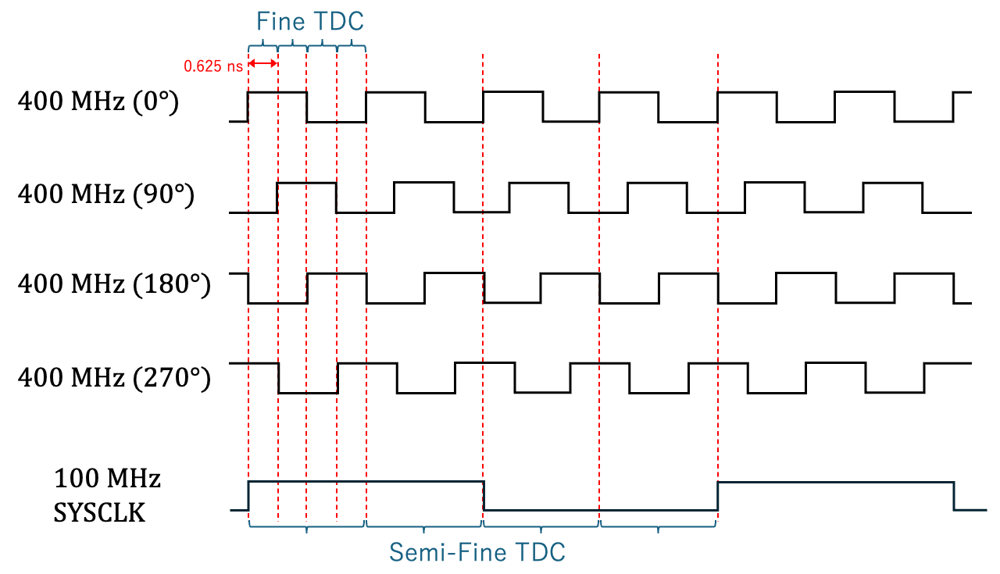
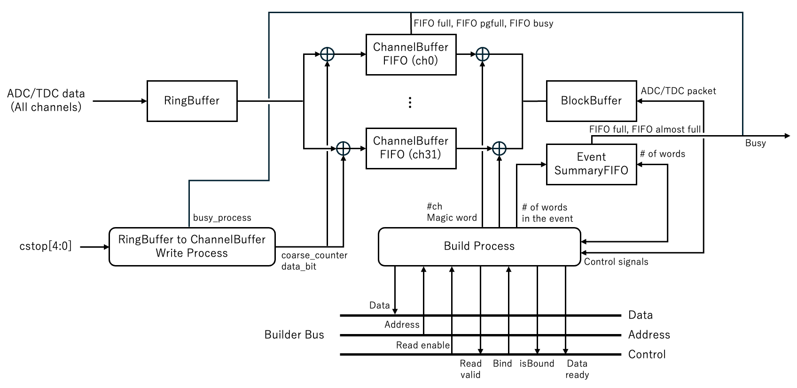
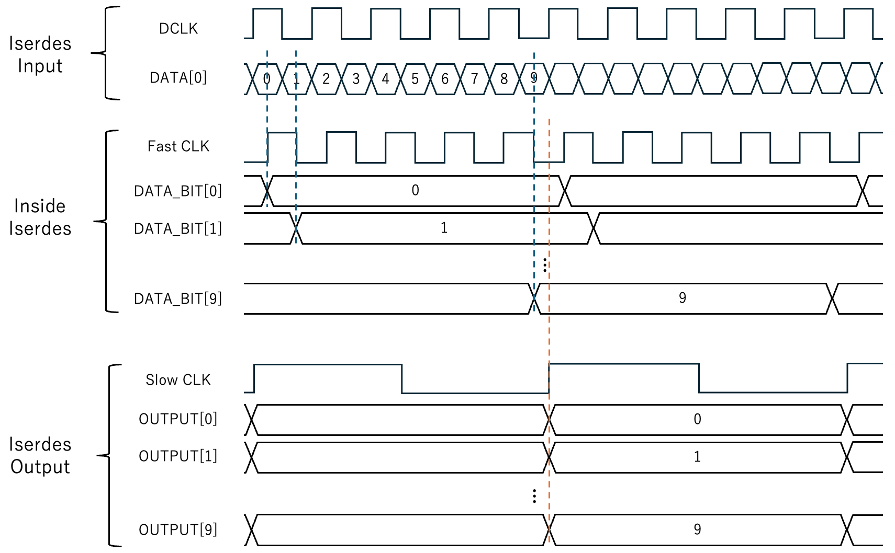

# Triggered-type ADC Multi-Hit TDC

## Multi-Hit TDC (MTDC)

### Outline

RAYRAWに実装されているTDCファームウェアは、Common Stopが発行されたタイミングからTime Window分だけさかのぼった時間内にあるヒットの立ち上がり・立ち下がり時刻を 1 LSB = 0.833 ns の時間分解能でそれぞれ（32chそれぞれで）最大16個記録する、Multi-Hit TDCである（[下図](#RAYRAW-TDC-CONCEPT)参照）。

{: #RAYRAW-TDC-CONCEPT width="50%"}

MTDCブロックの構造は[下図](#RAYRAW-MTDC)に示す通りである。

"){: #RAYRAW-MTDC width="55%"}

各々のコンポーネントは以下の働きを持つ:

- CommonStop: TRMからのL1accept入力の時刻を0.833 nsの時間分解能で測定し、5ビットのcstopを出力する。cstopのMSBはL1acceptの有無を、下位4ビットは 0.833 ns の細かい分解能を持つ時間情報を示す。
- TDCBlock (Leading): YAENAMIからの32ch Discri入力の立ち上がり時刻を 0.833 ns の細かい分解能で保持し、cstopが入力されたタイミングで粗い時間情報と組み合わせてEVBへとデータを送信する。また、処理の途中にはbusy信号をTRMへと送る。
- TDCBlock (Trailing): Discri入力の立ち下がり時刻を記録する。TDCBlock (Leading)と同一の構造を持つが、入力信号を反転させることで、立ち下がり時刻の測定を行っている。

### Fine TDC measurement (Multi-phase TDC)

0.833 nsで細かい時間情報を記録する部分はCommonStopとTDCBlockとで共通であり、[図](#RAYRAW-MTDC)ではFineCount Partとした。
このFineCount Partの実装を[下図](#RAYRAW-FINECOUNT)に示す。

{: #RAYRAW-FINECOUNT width="70%"}

各々のコンポーネントは以下の働きを持つ:

<!-- TDC formware is implemented so that it can record both leading edge and trailing edge of all the discrimination output of ASIC channels (32 in total). MTDC is designed to record all TDC value within time window, so this is called **Multi-Hit TDC**. Also, we adopted **Multi-phase Clock TDC** to record time finer.
-->


- FirstFDCEs: Discri入力を4つの異なる位相 (0°,90°,180°, 270°) を持つ300 MHzのクロック (4相クロック) でラッチする。これは後段でのメタステーブル状態を回避するための措置である。
- FineCounter: 前段の4つの出力を各々対応する4相クロックで再度ラッチした後、クロックドメインを統一するため位相0°で4つの入力をラッチする。位相0°と位相270°のクロックは立ち上がり時刻の差が0.833 nsしかなくFPGAの配線遅延の影響を受けるため、最初位相270°のクロックでラッチしたデータは他の位相のクロックでラッチしたデータと比べて1クロック遅れて後段に届く。そこで、これらのラッチされたデータのうち、初段において位相0°,90°,180°のクロックでラッチされていたデータを1クロックだけ遅らせる。
- FineCounterDecoder: 前段にて、システムクロック1周期につき4-bitsのデータが300 MHzのクロックドメインで得られたが、次はこれをシステムクロックに同期させる必要がある。TDC用クロック(300 MHz)/システムクロック(75 MHz)=4段のフリップフロップがあれば、TDCクロック4周期の間に4段×4ビット=16ビットのデータを保持することができる。これをシステムクロックの立ち上がりのタイミングでラッチすることにより、クロックドメインをシステムクロックに移すことができる。出力のfine countは4ビットで、上位2ビットがsemi-fine count (4段のどこにヒットがあったか)、下位2ビットがfine count (4つのクロックのどこにヒットがあったか)という情報を持っている ([下図](#RAYRAW-FINESEMIFINE)参照)。

出力hit_foundおよびfine_count[3:0]はそれぞれ1システムクロック内での信号の立ち上がりの有無と、その際の0.833 nsの精度での時間情報を表す。

{: #RAYRAW-FINESEMIFINE width="60%"}

### Event building

TDCBlockはCommonStopからの入力時に1イベントのデータをBuilder Busへと送る。
このEventBuild Partの[ブロック図](#RAYRAW-BCT-SLAVE)を下に示す。
図中の四角で囲まれた文字はコンポーネントを、角丸四角で囲まれた文字は一連の処理 (あるいはステートマシン) を示す。

{: #RAYRAW-BCT-SLAVE width="80%"}

TDCBlock内のFineCount Partで測定された1ビットのhit_foundと4ビットのfine_countは、システムクロックに同期して32chまとめてビット長160、深さ4096のリングバッファに詰められる。
cstop入力があると、RingBuffer to ChannelBuffer Write Processがcstop入力タイミングからTimeWindow分だけリングバッファを走査し、hit_foundが1の場合またはリングバッファの走査終了時に以下で計算されるTDC

```
TDC = (coarse_counter[10:0] & std_logic_vector(to_unsigned(0, 4))) - fine_count[3:0] + cstop[3:0]
```

を対応するチャンネルのChannelBufferに書き込む。
これは上位11ビットが75 MHzクロックで測られた粗い時間情報を、下位4ビットが位相が90°ずつ異なる300 MHzクロックで測られた細かい時間情報を持つ計15ビットのデータである。
実際には15ビットのTDCに加え、最上位ビットにdata_bitを付与する。
このdata_bitにはデータ読み出し時には値1(データ)、リングバッファの走査終了時には値0(イベント区切り)が詰められる。
ChannelBuffer内のTDCは、後段のFIFOやデータ転送に滞りのない限り順次Build Processにより

```
magic word (8-bits) & '0' & tdc_ch (7-bits) & '0' & TDC (15-bits)
```

のようにmagic wordとチャンネル情報を付与された32ビットワードが作られ、ch0からch31まで順次data_bitが1の場合にBlockBufferへと書き込まれる。
ここで、magic wordとはデータの内容を示す識別子であり、TDC(Leading)の場合は`X"cc"`、TDC(Trailing)の場合は`X"cd"`にそれぞれ設定されている。
書き込みが行われるたびに、Build Processはそのイベント内のワード数をカウントアップし、data_bitが0となった段階でワード数をEventSummaryFIFOに書き込む。
BlockBufferおよびEventSummaryFIFO内のワードはこのBuild Processを通じてBuilder Busへと送られる。

## ADC

### Outline

YAENAMIにはADC8つとその信号をデジタル化する際に使用されるクロックが内蔵されている。
このADCクロックは一般にFPGA内のシステムクロックと同期していないため、FPGA内でADCデータを取り扱うためにクロックの乗り換えが必要となる。
このため、1つのYAENAMIからは8本のデータ（DATA[7:0]）に加え、ADCクロック（DCLK）が送られる。
また、YAENAMIからは10ビットADCデータをシリアライズして1ビットずつ送っているため、FPGA内でこれをデシリアライズする必要がある。
そのために10ビットの先頭を示すフレーム信号（DFRAME）も送られる。
さて、FPGAでADCデータをサンプリングする際、[下図](#RAYRAW-ADC-SAMPLING)左のようにDATAあるいはDFRAMEの変化のタイミングがDCLKの立ち上がり・立ち下がりのタイミングと同時である場合（今回はDDR (Double Data Rate) を用いるので立ち下がりでもサンプリングが行われる）、データが安定していないタイミングでサンプリングを行ってしまうため正しいデータ取得ができない。
そこで、下図右のようにDATAが安定したタイミングでサンプリングを行うため、適切にDATAとDFRAMEを遅延させる必要もある。

"){: #RAYRAW-ADC-SAMPLING width="60%"}

以上をまとめると、ADCBlockの目的は4つのYAENAMIから送られてくる信号DATA[31:0]、DCLK[3:0]、DFRAME[3:0]を入力とし、クロックの乗り換えとデータの適切な遅延、デシリアライズを行うことである。
実際には、差動入力であるため正極性の信号DATA_P、DCLK_P、DFRAME_Pと負極性の信号DATA_N、DCLK_N、DFRAME_Nが入力となっている。

### Structure of ADCBlock

ADCBlockの構造を[下図](#RAYRAW-ADC)に示す。

"){: #RAYRAW-ADC width="100%"}


各コンポーネントの役割は以下の通り:

- IBUFDS: 差動入力バッファ。FPGA外部からの差動入力信号をシングルエンド信号にしてFPGA内に出力。
- BUFIO: クロックバッファ、すなわち入力信号と同じ周波数のクロックをFPGA内の一部領域に分配する。
- BUFR: BUFIOに分周の機能がついたもの。今回は1/5で分周を行なっている。クロックの乗せ替えやデシリアライズに使用される。
- IDELAY: 入力信号の遅延に使用。入力のREFCLKの値200/300/400 MHzに応じて78/58/39 ps単位の遅延を5ビットのtap値（最大32tap）で調整できる。今回は200 MHz REFCLKなので78 ps単位で遅延をかけている。
- ISERDES: シリアル入力をデシリアライズしてパラレル出力を得る。ここでは1ビットずつ10回送られてくるシリアルなADCデータを10ビットのデータに変換する。1:10のパラレル変換を行うため、2つのISERDESを利用（[UG471 p.156参照](https://docs.amd.com/v/u/ja-JP/ug471_7Series_SelectIO)）。
- VIO ADC: JTAG経由でFPGA内部の信号の読み出し、FPGA内部レジスタへの信号の書き込みを行う。en_ext_tapinを1に設定すると外部tapが有効化され、defRayrawAdcROV1.vhd内にあらかじめ記述されているtap値が使用され、en_ext_tapinが0の場合にはVIOで設定したtap値が使用される。
- ADC CDC FIFO: クロックをADCクロックからシステムクロックに乗り換えるためのFIFO。
- EventBuild Part: MTDCの項目に記述した通り。

また図には示していないが、YaenamiAdc.vhd内にはISERDESに入力するbitslipを制御するステートマシンがある。
1ビットの系列を10ビットデータにデシリアライズする際、元の10ビットデータを0~9ビット回転させたものが出力される。
ISERDESからの出力が元の10ビットデータに一致するように調整するため使用するのがbitslipである。
tap値が適切であればフレーム信号は常に0x300 (1100000000) になるべきなので、入力をDFRAMEとするISERDESの出力がこれに一致するまでbitslipを変化させて10ビット出力を10回回転させる。
ISERDESの出力フレーム信号が安定して（16回連続で）0x300に一致すればそのbitslipを採用する。

最終的には以下の32ビットのADCワードが1イベントあたりTimeWindowと同じ数だけ得られる：

```
ADC = magic word (4-bits) & adc_ch (5-bits) & "00" & coarse_counter (11-bits) & ADC (10-bits)
```
ADCのmagic wordは`X"a"`である。

### Note: ISERDES

最後にISERDESによるデシリアライズの過程を大まかに述べておく。
[下図](#RAYRAW-ISERDES)にISERDE入力、ISERDES内部、ISERDES出力のタイミングチャートを示す。
今回は1:10のデシリアライズのためISERDESを2つ使用しているため、実際のタイミングチャートはこれとは異なるが、動作自体は大同小異なのでこの図で説明を進める。
まず、ISERDESへの入力はADCクロックと同一周波数の速いクロックにより、ISERDES内部でDDRでサンプリングされる（図の青点線）。
この中間データが遅いクロックの周期と同じであれば、橙点線のタイミングで同時に10ビットを読み出すことができる。

{: #RAYRAW-ISERDES width="70%"}

<!--
The structure of the ADC block is shown in the [figure](#RAYRAW-ADC).
Each YAENAMI ASIC sends (serial) ADC digital output (8-bits), frame clock, data clock to the FPGA.
These inputs are labeled "DATA[31:0]", "DFRAME[3:0]", "DCLK[3:0]" in the figure, respectively.
These serial inputs are read out in the RayrawAdcRO block so that they are synchronized with the system clock. The data is continuously read out from ADC and the 
-->


## TRM

データ取得のトリガーはTDCのモジュール内で作られるCommon Stopであり、Common StopはIOMで指定したExtL1から作られる。
デフォルトの設定では、TRMのSelectTrigger[0]を"1"にし、DCTのDaqGateを"1"にした状態で、ExtL1(NIMIN1)にHの信号を送ることでデータを取得することができる。

### BUSYとなるタイミング
BUSY信号(module busy)を内部で作って、NIMOUTに出力できるようになっている。
ただしNIMINにBUSYとして入力させてもFirmware内では使われていないので、Triggerを出すNIMモジュールなどにVeto信号として用いることを推奨する。
BUSY信号は以下の信号のORとなっている。

|種類|長さ|備考|
|:----:|:----:|:----|
|Self Busy|200 ns|L1 triggerを検出した瞬間から固定長でアサート。|
|Sequence Busy||ADC、TDCのBufferやFIFOがFullになるとアサートされます。また、Common Stopを発行してから設定したTime Window分のRing Buffer内のデータ読み出しが終わるまでアサートされます。|
|FIFO Busy||使われていない。|

