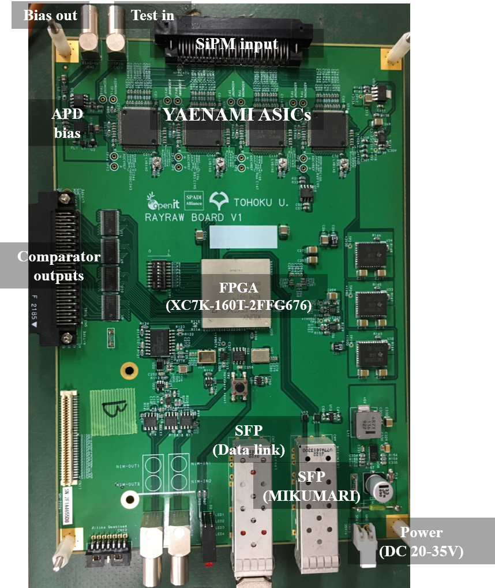
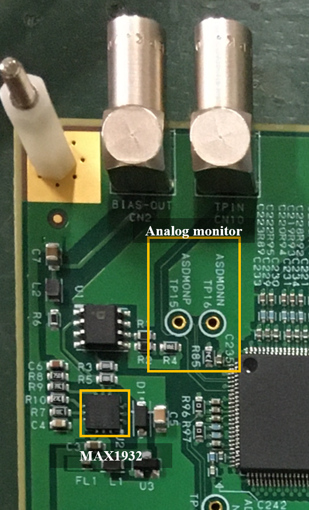
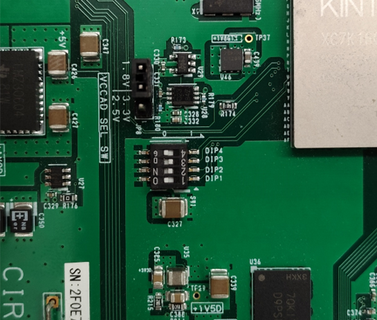
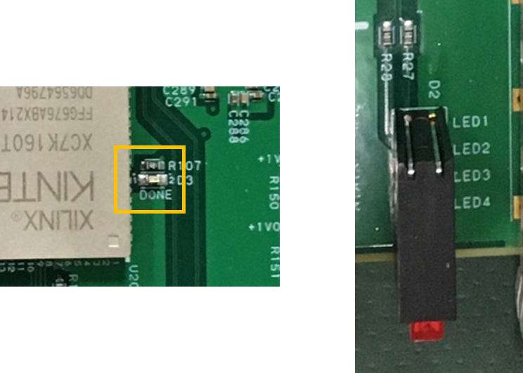
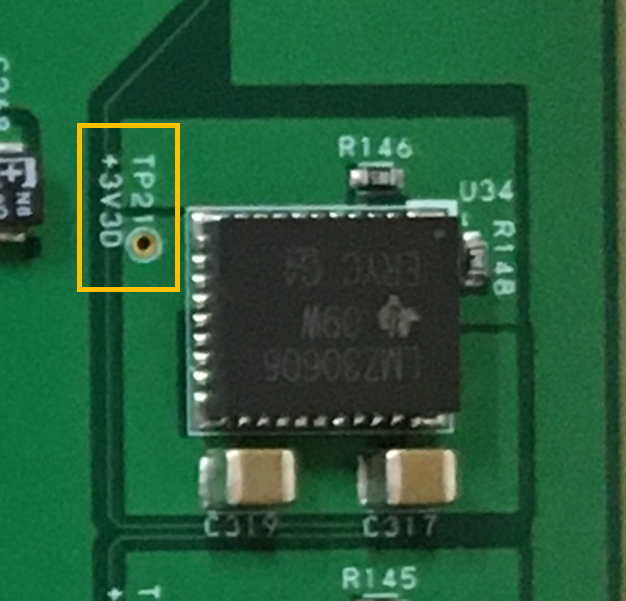

# RAYRAW-v1

The RAYRAW version 1 is a general purpose SiPM readout electronics using YAENAMI ASICs.
The board was designed to evaluate the YAENAMI ASICs, but this has enough functionaries to be used in a physics experiment.

- Manufacturer: 有限会社ジー・エヌ・ディー
- Product No: GN-2226-1

The [figure](#RAYRAW-PIC) shows the photograph of the RAYRAW-v1 board.
In this section, the author calls the RAYRAW-v1 as RAYRAW.
This is a 140 mm x 200 mm sized readout board with a SiPM input connector (HIROSE FX2B-68PA-1.27DSL(71)).
The connection between the input connector and ASICs is described in the [SiPM input sub-section](#sipm-input).
RAYRAW has a SFP+ port for a data link, a JTAG port, NIM IO, test input port, bias supply port, a MIKUMARI port for clock synchronization, and a power connector.
In addition, an multiplexed analog output from each ASIC can be monitored via through holes near by the ASIC.
The comparator (discriminator) parallel outputs from YAENAMIs are once fed into an FPGA, and then the copy of those signals are output from the "Comparator outputs" connector.
The FPGA mounted on the board is AMD Xilinx Kintex-7 FPGA (XC7K-160T-2FFG676C), which is the same as that of AMANEQ.
This board has the same a jitter (CDCE62002) as that on AMANEQ.
Thus, the digital part of RAYRAW is based on the design of AMANEQ, it uses many same ICs.
RAYRAW also has dedicated functionalities for operating SiPMs, i.e., an APD bias supply IC (MAX19232ETC+T).
Please also see the [AMANEQ user guide](https://spadi-alliance.github.io/ug-amaneq/) and the [RAYRAW user guide](https://spadi-alliance.github.io/ug-RAYRAW/).

{: #RAYRAW-PIC width="80%"}

The specification is summarized as follows.

- Size: 140 mm (H) x 200 mm (V)
- MPPC input
    - 128ch in total
    - Connector: FX2B-68PA-1.27DSL(71)
- ASIC: KEK E-sys YAENAMI x4
- Bias: MAX1932ETC+T
    - Supply range: 40-70V (256 steps)
    - Maximum output current: 2.5 mA
- Test inpout
    - 1.2 square wave input from a LEMO connector
- Analog outputs:
    - Differential output from each ASIC
- Parallel comparator (discriminator) outputs
    - KEL 8831E-068-170-F
    - User can select ground position from K-type (KEK) and L-type (LeCroy). Default is K-type, and if you need an L-type RAYRAW, please specify it when ordering.
- FPGA: AMD Xilinx XC7K-160T-2FFG676C
- Flash memory: CYPRESS S25FL128SAGMFIR01
- Data links: SFP+ (10 Gbps in maximum)
    - Link media depends on the type of SFP modules.
- Clock synchronization: One MIKUMARI port (SFP)
- Num of NIM input: 2 (LEMO)
- Num of NIM output: 2 (LEMO)
- Power supply: 20-35V DC
    - Jack: 2.10mm ID, 5.50mm OD
    - Main connector: 日本圧着端子 S2P-VH(LF)(SN)
    - **Note that the connector is different from that on AMANEQ**
- Fuse limit: 1A
    - Fuse product: Littelfuse 0251001.NRT1L
- Num of DIP switch bits: 8
- Clock generator IC: TI CDCE62002

{: #RAYRAW-BLOCK width="60%"}

MPPCs are biased by the MAX1932 bias supply, which is controlled by FPGA.
It can control output voltage with 256 steps between 40V to 70V.
The MPPC signal lines are parallel terminated with 100 ohm registers together with 0.22 uF capacitances for DC blocking.
The MPPC signals are fed into four YAENAMIs, and are amplified, shaped, and discriminated in YAENAMI.
The shaped analog signal is digitized by ADC in YAENAMI, and the digitized data are transferred to FPGA channel by channel.
For details of this YAENAMI, please see the ASIC section.
The comparator (discriminator) outputs are also input in parallel to the FPGA.

The YAENAMI is a free-run digitizer for a timing and a waveform; it continuously provides the waveform data and the comparator signals without any trigger signal.
The board is designed to implement the streaming readout ADC and TDC functions, but if users implement a triggered-type DAC function in FPGA, it can work as the triggered-type ADC and TDC.
The RAYRAW board equips the SFP port for synchronization, which is expected to be used for the MIKUMARI link protocol.

## Board interface

### SiPM input

{: #MPPC-CN width="90%"}

The [figure](#MPPC-CN) is the schematic drawing for the MPPC input connector (CN1).
The electrodes under the position marker are assigned as A1 and B1.
The connection between CN1 and FPGA is summarized as follows. Arrangement to the CN5 for which the comparator outputs is listed.

|CN1 (HIROSE)|MPPC-IN-NET|ASIC NUM|ASIC IN|FPGA IN|CN5 (KEL pos side)|CN5 (KEL neg side)|
|:----:|:----:|:----:|:----:|:----:|:----:|:----:|
|B32|0|U16|7|0|A3|A4|
|A32|1|U16|6|1|A5|A6|
|B30|2|U16|5|2|A7|A8|
|A30|3|U16|4|3|A9|A10|
|B28|4|U16|3|4|A11|A12|
|A28|5|U16|2|5|A13|A14|
|B26|6|U16|1|6|A15|A16|
|A26|7|U16|0|7|A17|A18|
|B24|8|U17|7|8|A19|A20|
|A24|9|U17|6|9|A21|A22|
|B22|10|U17|5|10|A23|A24|
|A22|11|U17|4|11|A25|A26|
|B20|12|U17|3|12|A27|A28|
|A20|13|U17|2|13|A29|A30|
|B18|14|U17|1|14|A31|A32|
|A18|15|U17|0|15|A33|A34|
|B16|16|U18|7|16|B3|B4|
|A16|17|U18|6|17|B5|B6|
|B14|18|U18|5|18|B7|B8|
|A14|19|U18|4|19|B9|B10|
|B12|20|U18|3|20|B11|B12|
|A12|21|U18|2|21|B13|B14|
|B10|22|U18|1|22|B15|B16|
|A10|23|U18|0|23|B17|B18|
|B08|24|U19|7|24|B19|B20|
|A08|25|U19|6|25|B21|B22|
|B06|26|U19|5|26|B23|B24|
|A06|27|U19|4|27|B25|B26|
|B04|28|U19|3|28|B27|B28|
|A04|29|U19|2|29|B29|B30|
|B02|30|U19|1|30|B31|B32|
|A02|31|U19|0|31|B33|B34|

### MPPC bias

{: #BIAS width="50%"}

MAX1932 can output bias voltage between 40V-70V with 256 steps, and it is controllable by FPGA through the network.
Bias voltage is output from the left side LEMO connector.

**The maximum output current is 2.5 mA.**

### Test input

The right side LEMO connector in the [figure](#BIAS) is a test input.
Please input 1.2V square wave with the pulse width longer than 1us, and thus a constant amount of charge injected to all the ASIC pre-amplifiers in ASIC at the square wave edges.
As it is not possible to inject arbitral amount of charge, this test input cannot be used for the calibration.
This input is common to all the ASICs.

### Analog monitor

An multiplexed analog output from each ASIC can be monitored via through holes near by the ASIC.
Please specify the target channel by slow control.
Please use a differential probe to read it. If you don't have it, please read a positive side using a passive probe.
This analog monitor port cannot drive a 50 ohm termination.

### SFP-1

The SFP-1 port is for a data link of which the speed is 10 Gbps in maximum.
The SFP and SFP+ modules are applicable but the link speed depends on firmware.
As this port is the same as that on AMANEQ, please also see the [AMANEQ user guide](https://spadi-alliance.github.io/ug-amaneq/hardware/overview/overview/#sfp1-2).

### DIP

{: #DIP width="70%"}

The DIP switch is set to the left side where "ON" is printed, a logic 0 is taken in the FPGA.
The function of each bit depends on each firmware.

### LED

{: #LED width="70%"}

There is an LED indicating FPGA configuration done near by the FPGA.
This LED lights up when the FPGA configuration is complete.
There are other four LEDs.
What the LED indicates depends on the firmware.

### NIM

The NIM output of RAYRAW uses a simplified method for converting to the NIM signal standard, and there are differences in the voltage recognized as logic-high among boards.
For this reason, even if the NIM output is made with the same firmware, the signal width and timing may appear slightly different.
It is not suitable for output of high-precision signals where timing is important.
The two NIM1 and NIM2 are printed on the silk screen on the board.

### Power supply

The power supply connector is 日本圧着端子 S2P-VH(LF)(SN).
There is a rule for power on/off process. Please see the [AMANEQ user guide](https://spadi-alliance.github.io/ug-amaneq/hardware/overview/overview/#power-supply).

### MIKUMARI port (SFP-2)

This is the same that of the AMANEQ. Please see the [AMANEQ user guide](https://spadi-alliance.github.io/ug-amaneq/hardware/overview/overview/#mikumari-port).

## Board ICs

The FPGA, the jitter cleaner IC, and the flash memory are the same those on AMANEQ.
Please see the [AMANEQ user guide](https://spadi-alliance.github.io/ug-amaneq/hardware/overview/overview/#power-supply-ics).

## Power supply ICs

{: #3V3D width="50%"}

The external DC voltage supply of 35V
RAYRAW uses the LT8612UDE to step down the external input of 35V to 5V, and then further steps it down to multiple power supply voltages.
A test pint are located near by each power supply IC as shown in the [figure](#3V3D).
Please confirm that every output voltage is correct after board delivery.

<table class="vmgr-table">
  <thead><tr>
    <th class="nowrap">Silk print</th>
    <th class="nowrap">Voltage</th>
    <th class="nowrap">Parts number</th>
    <th class="nowrap">Test pint number</th>
  </tr></thead>
  <tbody>
  <tr>
    <td class="tcenter">+5V</td>
    <td class="tcenter">+5.0V</td>
    <td class="tcenter">U38</td>
    <td class="tcenter">Nothing</td>
  </tr>
  <tr>
    <td class="tcenter">+3V3D</td>
    <td class="tcenter">+3.3V</td>
    <td class="tcenter">U34</td>
    <td class="tcenter">TP21</td>
  </tr>
  <tr>
    <td class="tcenter">+1V8D</td>
    <td class="tcenter">+1.8V</td>
    <td class="tcenter">U33</td>
    <td class="tcenter">TP20</td>
  </tr>
  <tr>
    <td class="tcenter">+1V0D</td>
    <td class="tcenter">+1.0V</td>
    <td class="tcenter">U32</td>
    <td class="tcenter">TP19</td>
  </tr>
  <tr>
    <td class="tcenter">+1V8GTX</td>
    <td class="tcenter">+1.8V</td>
    <td class="tcenter">U37</td>
    <td class="tcenter">TP24</td>
  </tr>
  <tr>
    <td class="tcenter">+1V2GTX</td>
    <td class="tcenter">+1.2V</td>
    <td class="tcenter">U35</td>
    <td class="tcenter">TP23</td>
  </tr>
  <tr>
    <td class="tcenter">+1V05GTX</td>
    <td class="tcenter">+1.05V</td>
    <td class="tcenter">U36</td>
    <td class="tcenter">TP22</td>
  </tr>
  <tr>
    <td class="tcenter">-3V3D</td>
    <td class="tcenter">-3.0V</td>
    <td class="tcenter">U7</td>
    <td class="tcenter">Nothing</td>
  </tr>
    <tr>
    <td class="tcenter">+3V3A</td>
    <td class="tcenter">+3.3V</td>
    <td class="tcenter">U31</td>
    <td class="tcenter">TP17</td>
  </tr>
    </tr>
    <tr>
    <td class="tcenter">+1V2A</td>
    <td class="tcenter">+1.2V</td>
    <td class="tcenter">U30</td>
    <td class="tcenter">TP18</td>
  </tr>
</tbody>
</table>

